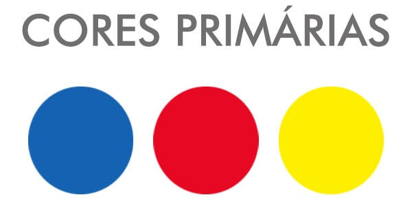
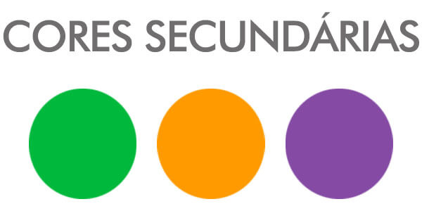
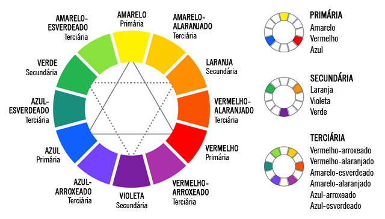

# cores
Projeto cores.com.br
<!DOCTYPE html>
<html>
<head>
</body>
</html>
<title>cores</title>
<BODY background="11.jpg">

<h1> &#160; Bem Vindos à minha Página!</h1>

<h2> &#160; Meu nome é Aline Logarezzi Valadão e meu Projeto é:</h2>

<h1> &#160; Teoria das Cores</h1>

<h2> &#160; As cores são gerados pela claridade do ambiente, na qual a cor branca é responsável por originar a luz.
  &#160; A união das sete cores são vermelho, laranja, amarelo, verde, azul, anil e violeta, já a cor preta representa a ausência de cor ou de luz.</h2>

<h1> &#160; Mistura de cores</h1>

<h2> &#160; Existem dois tipos de mistura de cores o aditivo e subtrativo. É fundamental entender a mistura de cores e o impacto que trazem.
  &#160; A tabela de mistura de cores são as primárias, secundárias e terciárias.</h2>

<h1> &#160; Cores primárias</h1>

<h2> &#160; As cores primárias são o amarelo, o vermelho e o azul. Elas recebem essa classificação porque não podem ser obtidas mediante a
  &#160; mistura de nenhuma outra cor.</h2>
&#160; 

<h1> &#160; Cores secundárias</h1>
<h2> &#160; As cores secundárias são aquelas que surgem a partir da mistura de cores primárias. São elas: laranja, roxo e verde. Veja quais
  &#160; são as misturas de cores primárias que dão origem às cores secundárias:
  
&#160; Amarelo + vermelho = laranja
 
&#160; Vermelho + azul = roxo ou violeta
 
&#160; Azul + amarelo = verde</h2>
&#160; 

<h1> &#160; Cores Terciárias</h1>

<h2> &#160; As cores terciárias são aquelas obtidas a partir da mistura de cores primárias com secundárias. Por exemplo:
  
&#160; Vermelho + roxo = vermelho-arroxeado (similar ao vinho)
 
&#160; Vermelho + laranja = vermelho-alaranjado ou laranja-escuro
 
&#160; Amarelo + verde = amarelo-esverdeado ou verde-claro
 
&#160; Amarelo + laranja = amarelo-alaranjado (similar ao bege)
 
&#160; Azul + roxo = azul-arroxeado
 
&#160; Azul + verde = azul-esverdeado (similar ao verde-água)</h2>

&#160; 

<h2> &#160; Para simplificar, veja essa tabela de mistura de cores:</h2>
&#160; 

<h2> &#160; Veja em seguida o Video explicativo:</h2>
&#160; <video width="900" height="500" controls="controls" autoplay="autoplay">
<source src="video.mp4" type="video/mp4">
<object data="" width="900" height="500">
<embed width="900" height="500" src="video.mp4">
</object>
</video>

<h1> &#160; Clique abaixo para baixar em PDF do Círculo Cromático da Teoria das Cores</h1>

&#160; <a href="16.pdf">

<h1> &#160; PDF do Círculo Cromático da Teoria das Cores</h1>

 &#160; 

</body>
</html>
